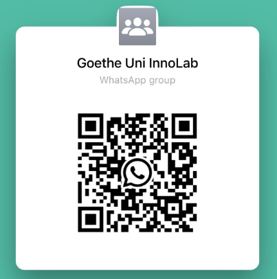

# Data Science Go Small

All great things come from the small beginnings 

## Slides 

__Tutorial 1__: [T01_slides.pdf](Tutorial_01/T01_slides.pdf)

Reading: 

- [R data.table Best Practices](https://oceanumeric.github.io/blog/r-data-table-best-practices)
- [Using Python and R in VSCode](https://oceanumeric.github.io/blog/r-python-vscode)
- [Facets of R](https://svn.r-project.org/Rjournal/trunk/html/archive/2009-1/RJournal_2009-1_Chambers.pdf)
- other pdf files in `Tutorial_01` folder
- [advanced data.table](https://cran.r-project.org/web/packages/data.table/vignettes/)

__Tutorial 2__: 

__Tutorial 3__: 

__Tutorial 4__: 

__Tutorial 5__: 

## Whatsapp Group

Studying in a group is encouraged. There is a whatsapp group for this course. In case you want to ask questions to your peers, please join the group.

