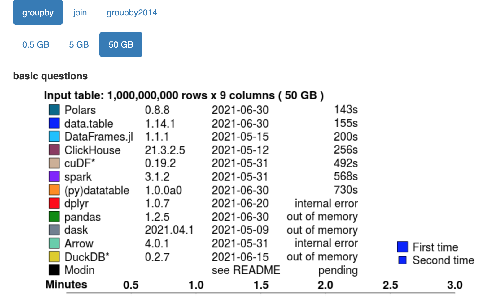

# Practice #1: Introduction to R Programming with AI

- Basic R Programming
- data.table package for Big Data
    - 1GB to 100GB
- R with AI
- Data exploration with R


--- 

# R Programming

- Any programming language has 3 basic components
    - Data Structure
    - Control Structure
    - Function


---

# Data Structure


- We will focus on `vector and data.table (data frame)` in this practice.
    - Vector
    - Matrix
    - Array
    - List
    - Data Frame (Table)
    - Factor (Categorical Data)


---

## Vector

- Vector is a basic data structure in R.
- A vector is a sequence of data elements of the same basic type.
- it is a container which can hold items of __same type__.


---

## Vector

- To create a vector, you need
    - `c()` function
    - variable name
    - values
- what is variable name?
    - it is a name of a container which can hold values.
    - it is a name of a memory location.


---

## Copilot Tips

- There is new concept called `prompt` in AI programming.
- There is a concept called `Chain-of-thought` in AI programming.
- The ideas is that you can write a code with AI.
    - only if human being can understand your instructions too
    - only if your design a `good prompt`


---

## Good Prompt

- Good prompt is a prompt which can be understood by human being.
- Good prompt is a prompt which can be understood by AI.
- Examples
    - `# first column is a sequence from 1 to 20`
    - `# third column is sample drawn from ['female', 'male']`

---

## Good Prompt

```r
# create a data.table for me with 20 rows and 4 columns
# first column is a sequence from 1 to 20
# second column is sample drawn from a normal 
# distribution with mean 0 and sd 1
# third column should be filled with two values: 1 and
# 0 in a random fashion
# fourth column should be filled with 20 random
# characters from the alphabet

my_dt <- data.table(
  x = 1:20,
  y = rnorm(20, mean = 0, sd = 1),
  z = sample(c(0,1), 20, replace = TRUE),
  w = sample(letters, 20, replace = TRUE)
)

print(my_dt)
```

---

## Bad Prompt

- The following prompt is not a good prompt because it is not understandable by human being. Therefore, AI gives an error message.

```r
# create a data.table for me with 20 rows and 4 columns
# first column is a sequence from 1 to 20
# second column is sample drawn from a normal 
# distribution with mean 0 and sd 1
# third column drawn from ['female', 'male']
```


---

###  Why data.table?

- data.table is a package for Big Data.
- Benchmarking




----

## Why data.table?

- it is just `data.frame` with more features.
- `data.frame` is a basic data structure in R.


---

## Summary

- Vector is a basic data structure in R.
- To create a vector, you need
    - `c()` function
    - variable name
    - values
- data.table is a package for Big Data.
- data.table is just `data.frame` with more features.
- what is good prompt and bad prompt?


--- 


