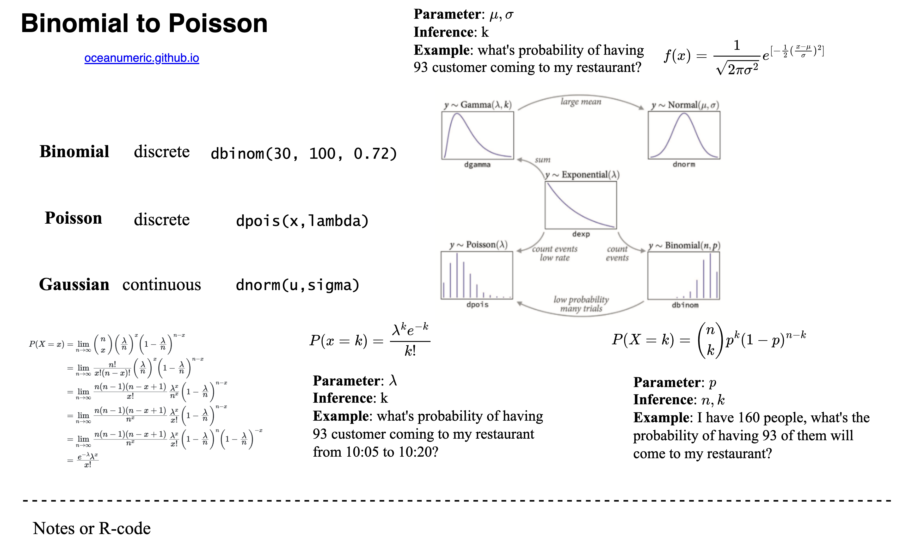
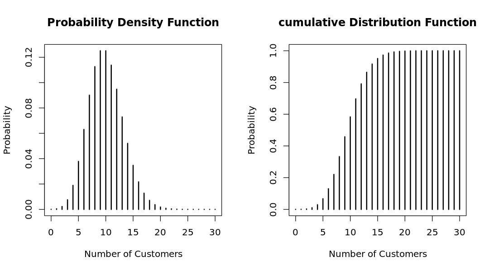
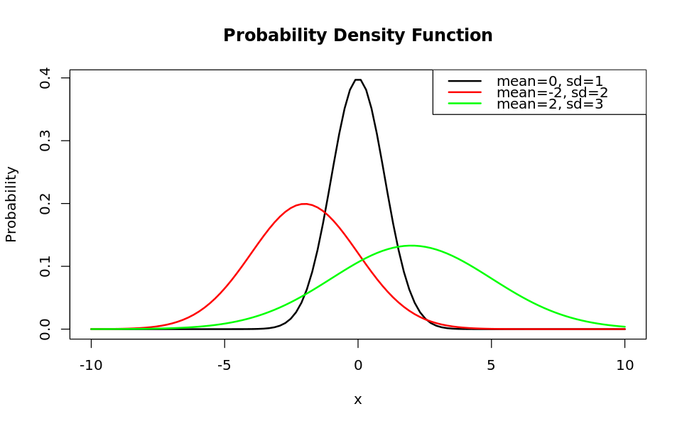
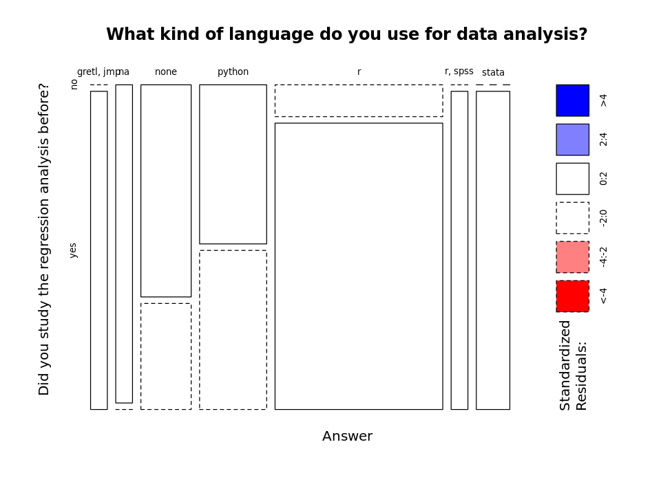

# Institutions and Innovation

## Tutorial 01 - Statistics Review

Prof. Dr. Cornelia Storz
Fei Wang (Michael) :heart: AI
Goehte University Frankfurt
Summer Semester 2023


---

# Roadmap of this tutorial

#### 1.  [Introduction to `data.table`](#1-introduction-to-datatable)
#### 2.  [Univariate Statistics](#2-univariate-statistics)
#### 3.  [Bivariate Statistics](#3-bivariate-statistics)
#### 4.  [Multivariate Statistics](#4-multivariate-statistics)
#### 5.  [Regression Analysis](#5-regression-analysis)
#### 6.  [Summary](#6-summary)


---

# 1. Introduction to `data.table` 


---

# 1.1. What is `data.table`?

- `data.table` is a package in R that provides an enhanced version of data.frame. It is widely used for fast aggregation of large datasets, low latency add/update/remove of columns, quicker ordered joins, and a fast file reader. `data.table` is an extension of `data.frame` package in R. 
- check benchmark: https://h2oai.github.io/db-benchmark/
    - 100 GB data
    - 155 seconds
    - out of memory for `Pandas`


---

# In-class Lab 1.1 :butterfly:


---

# In-class Lab 1.1 :butterfly:


---

# In-class Lab 1  :butterfly:

```r
# library
library(data.table)

# read the dataset from url
# url: https://shorturl.at/eixVX
csv_url <- "https://shorturl.at/eixVX"
survey <- fread(csv_url)

# check the data
str(survey)
head(survey)
summary(survey)
```


---

# 2. Univariate Statistics


--- 

# 2.1. What is Univariate Statistics?

- Univariate analysis is the simplest form of analyzing data. <mark>“Uni” means “one”</mark>, so in other words your data has only one variable. It doesn’t deal with causes or relationships (unlike regression) and it’s major purpose is to describe; It takes data, summarizes that data and finds patterns in the data.

- Methods:
    - Discrete data: frequency table, bar chart, pie chart
    - Continuous data: histogram, box plot, summary statistics


---

# 2.2. Discrete Data


<div class="columns">
<div>

For discrete data, we can use 
- frequency table
- bar chart
- pie chart to visualize the data.


</div>
<div>

|q1  |  N|
|:---|--:|
|no  |  6|
|yes | 16|

</div>
</div>

--- 


# 2.2.1. Bar plot


```r
# use basic R function to get the frequency table
survey %>%
    with(table(q1)) %>%
    kable()

# using prop.table function to get the percentage
survey %>%
    with(table(q1)) %>%
    prop.table() %>%
    kable()

options(repr.plot.width = 8, repr.plot.height = 5)
survey %>%
    with(table(q1)) %>%
    barplot(main = "Did you study the regression analysis before?",
            xlab = "Answer",
            ylab = "Count",
            col = "lightblue")
```


--- 

# 2.2.2. Binomial Distribution

- Binomial distribution is a discrete probability distribution that expresses the probability of one set of two outcomes, as a function of the number of trials.

- In our survey, 70% of the students have studied the regression analysis before. We can use binomial distribution to calculate the probability of the number of students who have studied the regression analysis before.

- One class has 100 students. What is the probability that 30 of them have studied the regression analysis before?


---

# 2.2.2. Binomial Distribution

- `dbinom(x, size, prob)` is the function to calculate the probability of x successes in size trials with the probability of success prob.

- `pbinom(x, size, prob)` is the function to calculate the cumulative probability of x successes in size trials with the probability of success prob.

```r
# probability of 30 students have studied the regression analysis before
dbinom(30, 100, 0.7)  # discrete probability
pbinom(30, 100, 0.7)  # cumulative probability
```

- The formula of binomial distribution is:

$$
P(X=k) = \binom{n}{k}p^k(1-p)^{n-k}
$$

--- 

# 2.2.2. Binomial Distribution (discrete probability)


--- 

# 2.2.2. Binomial Distribution (discrete probability)

- Properties of binomial distribution:
    - The mean of binomial distribution is $np$.
    - The variance of binomial distribution is $np(1-p)$.
    - The standard deviation of binomial distribution is $\sqrt{np(1-p)}$.

- For instance, the mean of the number of students who have studied the regression analysis before is $100 \times 0.7 = 70$.


--- 

# 2.2.2. From Binomial Distribution to Poisson Distribution

> Now, suppose you are a restaurant owner. You want to know how many customers will come to your restaurant from 10am to 11am. How could you estimate the number of customers?

&nbsp;


--- 

# 2.2.2. From Binomial Distribution to Poisson Distribution

> Now, suppose you are a restaurant owner. You want to know how many customers will come to your restaurant from 10am to 11am. How could you estimate the number of customers?

1. Do a survey?
    - fixed time and space
2. Use the competitor's data?
    - different restaurant
    - fixed time and people


--- 

# 2.2.2. From Binomial Distribution to Poisson Distribution

> Now, suppose you are a restaurant owner. You want to know how many customers will come to your restaurant from 10am to 11am. How could you estimate the number of customers?

- Our univariate dimension:
    - time: 10am to 11am
    - space: the restaurant
    - people: customers
    - event: customers come to the restaurant


---

# 2.2.2. From Binomial Distribution to Poisson Distribution


---

# 2.2.2. From Binomial Distribution to Poisson Distribution



---

# 2.2.3. Poisson Distribution

- Poisson distribution is a discrete probability distribution that expresses the probability of a given number of events occurring in a fixed interval of time or space if these events occur with a known constant mean rate and independently of the time since the last event.

- For example,
    - the number of customers who come to the restaurant from 10am to 11am
    - the number of students who come to the class from 10am to 11am
    - the number of cars that pass through a crossroads between 10am and 11am


---

# 2.2.3. Poisson Distribution

- Parameters of Poisson distribution:
    - $\lambda$ is the mean number of events in an interval
- Inference: 
    - $k$ is the number of events in an interval
    - $e$ is the Euler's number ($e = 2.71828...$)

$$
P(x = k) = \frac{\lambda^k e^{-\lambda}}{k!}
$$


---

# 2.2.3. Poisson Distribution



--- 

# 2.2.4. Normal Distribution

- Normal distribution is also called Gaussian distribution. It is a continuous probability distribution that is symmetrical on both sides of the mean, so the right side of the center is a mirror image of the left side.

$$
f(x) = \frac{1}{\sigma \sqrt{2 \pi}} e^{-\frac{1}{2} (\frac{x-\mu}{\sigma})^2}
$$

---

# 2.2.4. Normal Distribution



--- 

# 3. Bivariate Statistics


--- 

# 3.1. What is Bivariate Statistics?

- Bivariate analysis is one of the simplest forms of quantitative analysis. It involves the analysis of two variables (often denoted as X, Y), for the purpose of determining the empirical relationship between them. It is basically the analysis of two variables simultaneously, in order to determine the empirical relationship between them.
    - cross tabulation (contingency table) for discrete data
    - correlation for continuous data
    - covariance for continuous data


---

# 3.2. Cross Tabulation

- Cross tabulation is a tool that allows you compare the relationship between two variables. It is also known as contingency table. It is a table showing the distribution of one variable in rows and another in columns, used to study the correlation between the two variables.


|    | gretl, jmp| na| none| python|  r| r, spss| stata|
|:---|----------:|--:|----:|------:|--:|-------:|-----:|
|no  |          0|  1|    2|      2|  1|       0|     0|
|yes |          1|  0|    1|      2|  9|       1|     2|


---

# 3.2. Cross Tabulation

- We could use mosaic plot to visualize the cross tabulation.




---

# 4. Multivariate Statistics


---

# 4.1. What is Multivariate Statistics?

- Multivariate analysis is based on the principles of multivariate statistics, which involves observation and analysis of more than one statistical outcome variable at a time. Typically, it involves a combination of two or more variables. 
- Methods:
    - multiple regression
    - factor analysis
    - cluster analysis
    - Neural Networks


---

# 5. Regression Analysis


---

# 5.1. What is Regression Analysis?

- Regression analysis is a form of predictive modelling technique which investigates the relationship between a dependent (target) and independent variable (s) (predictor). This technique is used for __forecasting__, time series modelling and finding __the causal effect relationship__ between the variables.

    - we will focus on forecasting in this tutorial
    - and causal effect relationship in the next tutorial


---

# 5.2 Linear Regression

- There many resources on the internet about linear regression. Here, we will focus on the implementation of linear regression in R.

    - Recommendation:
        - [An Introduction to Statistical Learning](https://www.statlearning.com/)
        - [Regression in R](https://youtu.be/gNZfqHhq_B4)

- Basic idea: dependent variable is a linear function of independent variables.

$$
y = \beta_0 + \beta_1 x_1 + \beta_2 x_2 + ... + \beta_n x_n + \epsilon; \quad \epsilon \sim N(0, \sigma^2)
$$

- The simplest neural network is linear regression.

---

# 5.2 Linear Regression

- Key assumptions:
    - linearity : $y = \beta_0 + \beta_1 x_1 + \beta_2 x_2 + ... + \beta_n x_n + \epsilon$ is a linear function 
    - independence : $\epsilon$ is independent of $x_1, x_2, ..., x_n$ 
    - homoscedasticity : $\epsilon$ has the same variance $\sigma^2$
    - normality : $\epsilon$ is normally distributed


---

# 5.2 Linear Regression: interpretation


generate table with 3 columns and 3 rows 

|    | $X$ | $\ln(X)$ |
| --- |:----|:---------|
|$Y$  |  __Linear__: $Y = \beta_0 + \beta_1 X$ <br> _one unit change in $X$ leads  <br> to $\beta_1$ unit change in $Y$_  |  __Linear-log__: $Y = \beta_0 + \beta_1 \ln(X)$ <br>  _one percent change in $X$ <br> leads to $\beta_1/100$ unit change in $Y$_  |
|$\ln(Y)$ |  __Log-linear__: $\ln(Y) = \beta_0 + \beta_1 X$ <br> _one unit change in $X$ leads  <br> to $100 \times \beta_1$ unit change in $Y$_  |  __Log-log__: $\ln(Y) = \beta_0 + \beta_1 \ln(X)$  <br>  _one percent change in $X$ <br> leads to $\beta_1$ percent change in $Y$_ |


---

# In-class Lab 2 :butterfly:


---

# In-class Lab 2 :butterfly: Boston Housing Dataset

```
            ===============================================
                                    Dependent variable:    
                                ---------------------------
                                        medv            
            -----------------------------------------------
            lstat                        -0.950***         
                                        (0.039)          
                                                        
            Constant                     34.554***         
                                        (0.563)          
                                                        
            -----------------------------------------------
            Observations                    506            
            R2                             0.544           
            Adjusted R2                    0.543           
            Residual Std. Error      6.216 (df = 504)      
            F Statistic          601.618*** (df = 1; 504)  
            ===============================================
            Note:               *p<0.1; **p<0.05; ***p<0.01
```

---

# 5.2 Linear Regression: interpretation

- __Linear__: $Y = \beta_0 + \beta_1 X$ 
    - one unit change in $X$ leads to $\beta_1$ unit change in $Y$ 
    - $\beta_1 = -0.950$ means that one unit increase in `lstat` leads to $-0.950$ unit decrease in `medv`

|    | Estimate| Std. Error| t value|
|:---|--------:|----------:|-------:|
|(Intercept)|  34.55384|   0.56263|  61.415|
|lstat      |  -0.95005|   0.03873| -24.528|


---

# 6. Summary

